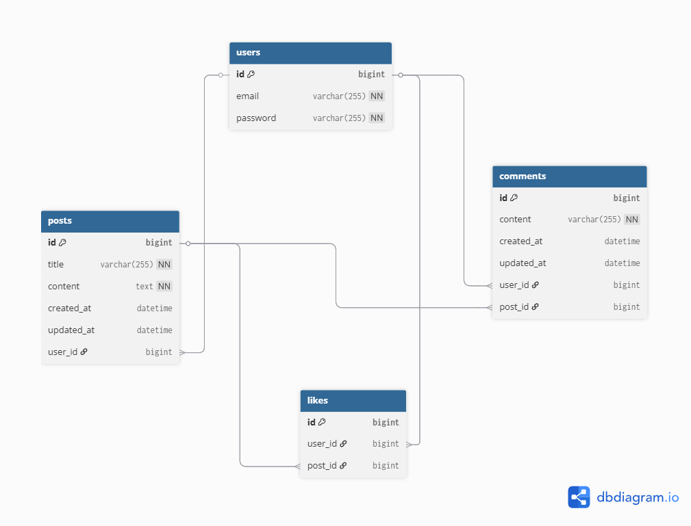

# spring-board-1st

# 🚀 Social Network API Core Engine

본 프로젝트는 SNS의 핵심 기능(게시판, 댓글, 좋아요, 회원 인증)을 구현한 **RESTful API 백엔드 엔진**입니다.
CRUD와, JWT 기반의 무상태(Stateless) 인증 아키텍처와 도메인 주도(Domain-Driven) 패키지 설계를 적용하여 확장성과 유지보수성을 극대화했습니다.

> **[실시간 배포 주소]** : [https://spring-board-1st.onrender.com/](https://spring-board-1st.onrender.com/)  
> **[Frontend 깃허브 레포]** : https://github.com/mseojin60/spring-board-front-1st.git

(※ 현재 백엔드 엔진 및 프론트엔드 연동 배포 완료.)

## 🛠️ Tech Stack
- **Language:** Java 21
- **Framework:** Spring Boot 3.4.5
- **Database / ORM:** MySQL, Spring Data JPA
- **Security:** Spring Security, JWT (io.jsonwebtoken 0.12.6)
- **Documentation:** Swagger (Springdoc OpenAPI)

## 📁 Architecture Highlights
본 프로젝트는 관심사의 명확한 분리를 위해 **도메인형 패키지 구조**를 채택했습니다.
- `domain`: `user`, `post`, `comment`, `like` 등 각 비즈니스 로직을 독립적으로 모듈화
- `jwt`: 토큰 생성(`JwtUtil`) 및 요청 검증(`JwtAuthFilter`)을 위한 시큐리티 코어
- `global`: 전역 예외 처리(`GlobalExceptionHandler`)를 통한 일관된 에러 응답 규격화
- `config`: Security 및 CORS 등 전역 설정 관리

## 📌 Core Features & API Endpoints

## ERD

### 1. User (회원)
- `POST /api/auth/signup` : 이메일/비밀번호 기반 회원가입
- `POST /api/auth/login` : JWT 인증 토큰 발급 (로그인)

### 2. Post (게시물)
- `POST /api/posts` : 새 게시물 작성 (JWT 요구)
- `GET /api/posts` : 게시물 전체 페이징 조회
- `GET /api/posts?email={email}` : 특정 작성자(이메일) 기준 게시물 조회
- `PUT /api/posts/{id}` : 본인 게시물 수정
- `DELETE /api/posts/{id}` : 본인 게시물 삭제

### 3. Comment (댓글)
- `POST /api/comments/{postId}` : 특정 게시물에 댓글 작성
- `PUT /api/comments/{id}` : 본인 댓글 수정
- `DELETE /api/comments/{id}` : 본인 댓글 삭제

### 4. Like (좋아요)
- `POST /api/likes/{postId}` : 게시물 좋아요
- `DELETE /api/likes/{postId}` : 게시물 좋아요 취소

## 🔐 Security (JWT)
- **Stateless Authentication:** 세션을 사용하지 않고 JWT 헤더(`Bearer`)를 통한 무상태 인증 구현
- **Custom Filter:** `OncePerRequestFilter`를 상속받은 `JwtAuthFilter`를 통해 모든 인가된 API 요청 검증

## 📄 API Documentation
프로젝트 실행 후, 아래 URL을 통해 Swagger UI에서 상세한 API 명세와 직접 테스트를 진행할 수 있습니다.
- **Swagger UI:** `https://spring-board-1st.onrender.com/swagger-ui/index.html`
